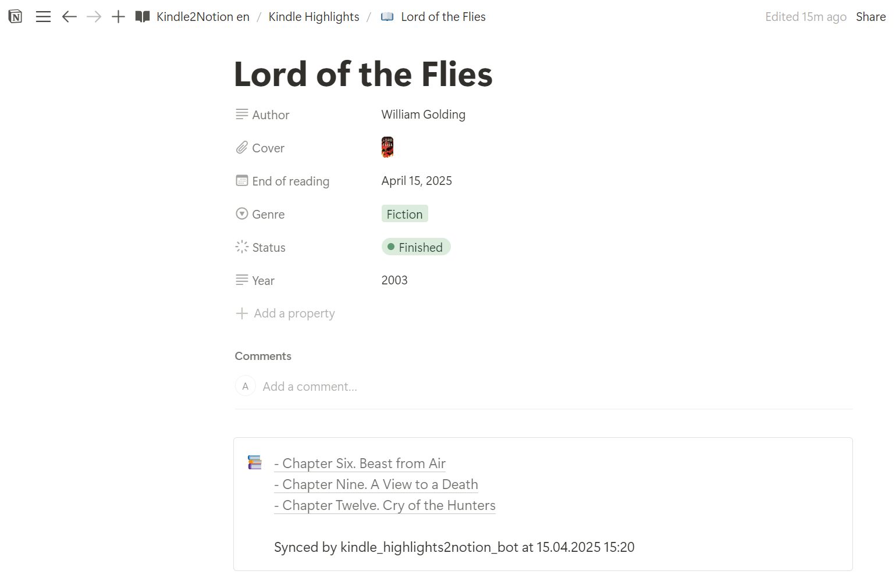
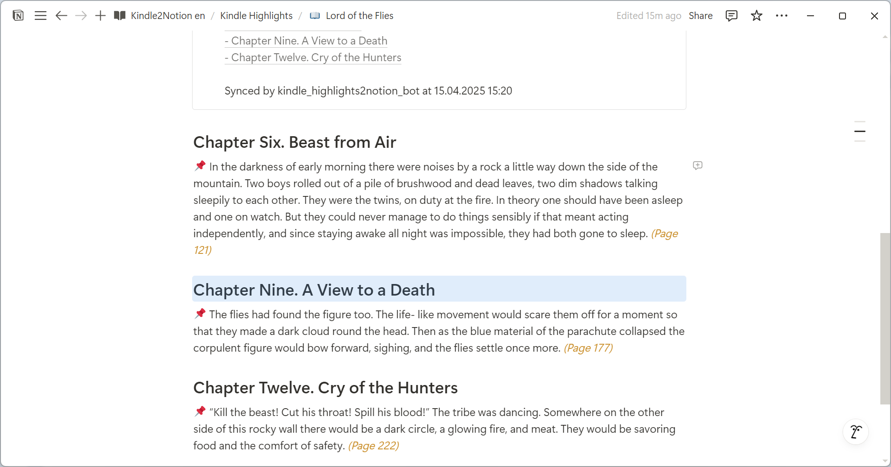
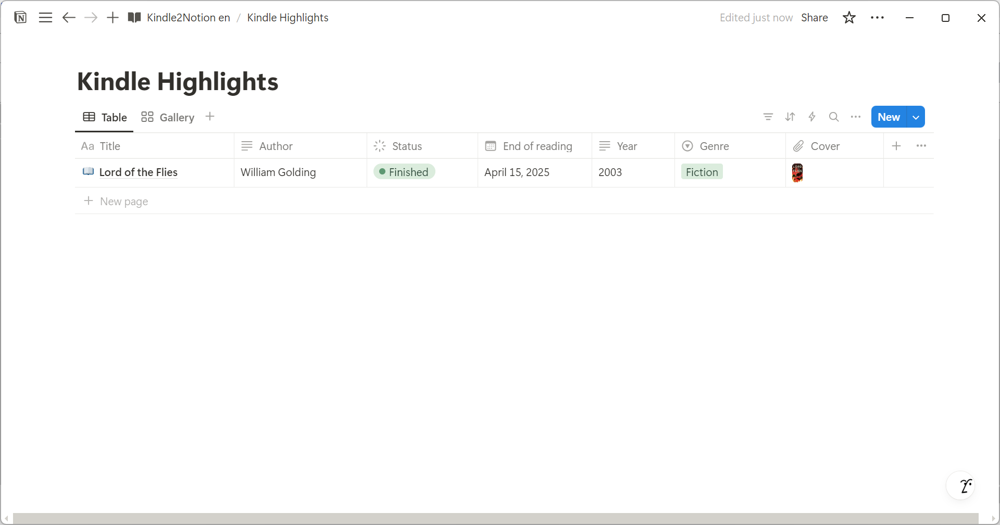
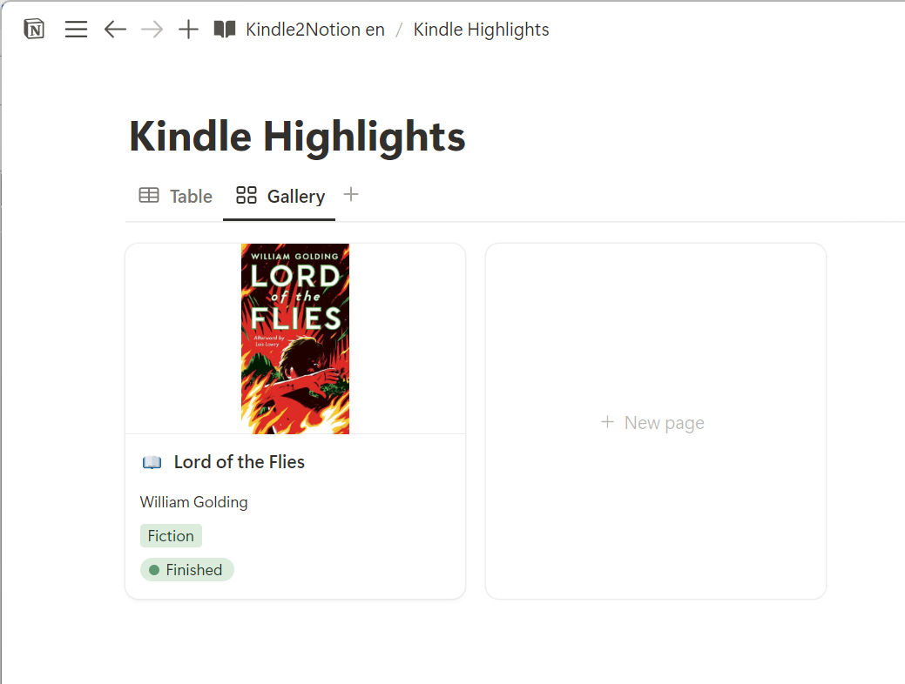

# Kindle Highlites 2 Notion Bot 

This Telegram bot lets you upload Kindle highlights (APA-style HTML) and automatically imports them into Notion — with formatting, cover image selection, genre tagging, and more.


## Disclaimer
I am not a professional programmer, but a hobbyist who writes code with ChatGPT and Gemini for my own needs. Therefore, this code may be funny, silly, or incorrect - I absolutely understand that. If you have any tips on how to improve it, I will be grateful for the hints, but I don't promise that I will be able to implement them.


---

## ✨ Features

- Parses Kindle APA HTML highlights
- Detects title, author, sections, pages, highlight color
- Automatically creates or updates a Notion book page
- Adds Table of Contents with anchor links
- Lets you choose a genre, cover image, and reading status
- Emoji-based page icons based on genre
- Optional manual cover image upload
- Syncs highlights with dates and metadata

---
## Preparation:
### 1. Create a notion database with the required fields

|Propety name | Property type|
|---------------|----------------|
|Title | Text|
|Author | Text|
|Status | Status|
|End of reading | Date|
|Year | Text|
|Genre | Select|
|Cover | Files & media|

Do not change the name of the properties or if you want to - then edit them in notion_client.py

### 2. Create a connection and connect it to your database
To allow the bot to access your Notion workspace and database, follow these steps:

1️⃣ Create a New Integration in Notion
Go to https://www.notion.so/profile/integrations
- Click +New integration
- Give your integration a name (e.g. Kindle2Notion Bot)
- Select the workspace you want to connect it to
- Under Capabilities, enable:
  ✅ Read content
  ✅ Insert content
  ✅ Update content
- Click Submit
- Copy the Internal Integration Token — you’ll use this as NOTION_API_KEY in your .env or stack.env

2️⃣ Share Your Notion Database with the Integration
- Navigate to the database you want the integration to access.
- Click on the ••• (More options) button at the top-right corner of the page (not the table!)
- Select Connections from the dropdown menu.
- In the pop-up, search for the name of your integration.
- Select your integration and click Confirm to grant it access to the database.

3️⃣ Find Your Notion Database ID
- Open your Notion database in a browser
- Look at the URL — it should look like:
```text
https://www.notion.so/yourworkspace/Book-Highlights-abcd1234ef56789012345678abcdef12
```

The long string at the end (32 characters) 
```text
abcd1234ef56789012345678abcdef12
```
is your database ID
Use this as NOTION_DATABASE_ID in your .env or stack.env

### 3. Create telegram bot via @BotFather
Use it's Token as TELEGRAM_BOT_TOKEN in your .env or stack.env.


---
## 🚀 Quick Start

### 🐳 Option 1: Run with Docker

1. Copy the example environment file:
```bash
cp stack.env.example stack.env
```
2. Build and run the bot:
```bash
docker compose up --build -d
```

### 🐍 Option 2: Run manually (Python)
1. Create and activate a virtual environment:
```bash
python -m venv venv
source venv/bin/activate        # On Linux/macOS
venv\Scripts\activate           # On Windows
```

2. Install dependencies:
```bash
pip install -r requirements.txt
```

3. Copy environment variables:
```bash
cp .env.example .env
```

4. Run the bot:
```bash
python bot.py
```

🔐 Environment Variables (.env)
|Variable | Description|
|---------------|----------------|
|TELEGRAM_BOT_TOKEN | Your Telegram bot token|
|NOTION_API_KEY | Notion integration token|
|NOTION_DATABASE_ID | Notion database ID|

---
Don't forget to create a file named .env (see .env.example) with your credentials

---
# How to use the bot:
1. Install the official Kindle app on your phone/tablet
2. Download the book from which you want to export highlights
3. Click on Highlights - Share
4. Be sure to select Citation style - APA
5. Send the resulting HTML file to your bot
6. If necessary, edit the Title and Author, add a Cover page
   Enjoy!

---
<details>
<summary><b>📸 Example Output</b></summary>




</details>
---
## 💖 Support

If you find this project useful, you can support me here:

<a href='https://ko-fi.com/V7V71DIZWQ' target='_blank'></a>
